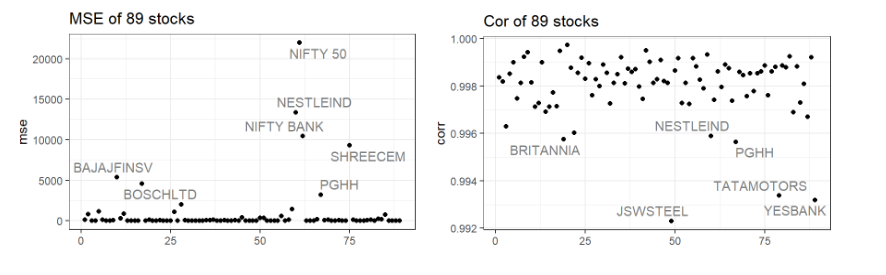
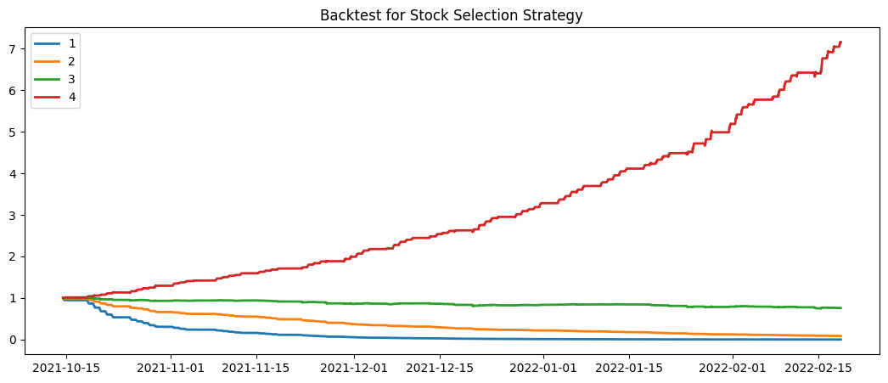

[**GitHub repository**](https://github.com/rzhao-99/605project)  

#### **1. Introduction**
In recent years, quantitative investment research has become a hot spot in the field of finance. In many cases, it involves deep learning and huge datasets (several Terabytes). In this situation, running parallel jobs in CHTC is definitely an efficient way.

#### **2. Dataset**
The 13 GB dataset describes data of 100 stocks (Nifty 100 stocks) of the Indian stock market from Jan 2015 to Feb 2022. It consists of data samples of 5-minute intervals, and 2 indices (Nifty 50 and Nifty Bank indices). Along with OHLCV (Open, High, Low, Close, and Volume) data.

Since our dataset is clean and there is no NA in it, we only delete 11 datasets whose start dates are too late to provide enough information we need. After that, we unify the start and end time of the dataset as 2015/02//02 14:30 - 2022/02/18 15:25.

#### **3. LSTM Model**
##### Basic Model
We use the LSTM model, which is designed to model the time series data and enable us to predict stock closing prices. LSTM is a deep learning-based model that evolved from the RNN model in order to solve the vanishing gradient and exploding gradient problem. The LSTM model separates the information flow into long-term memory and short-term memory, and also adds a mechanism to forget past information, which enables the model to overcome the challenge. 

##### Basic Setting
We use 95% of the data as a training set and the rest as a testing set. Specifically, we consider each training unit as a series of closing prices with a length of 60. We will use the first 59 closing prices to predict the 60th closing price. After training is complete, we calculate the RMSE to evaluate the performance of our model.

##### Parameter Tuning
The main parameter to adjust is the batch size, which determines how many training samples we will consider at once to update our model. Following the common practice, we have tested several different batch size options such as 8, 16, 32, 64, and 128.  It turns out that batch size 64 gives us the best result. Training time for each stock is reduced to 20 minutes due to the increasing batch size, and the performance is not hurt. We have also tested the effect of different sizes for hidden layers. We end up using two LSTM layers with hidden sizes 128 and 64.

#### **4. Computational Steps**
We use Miniconda3 to build and manage our environment. We first process the raw data outside of the CHTC and then upload them to the CHTC. In order to run all jobs in one submission, we upload a list containing the names of each stock, then we use queue to read from the list iteratively. Finally, we run the LSTM model and get the prediction for each stock. Each job uses 1.6 GB of disk space and 835 MB of memory. The total time is 3 hours.

##### Result Evaluation
We use MSE and the Correlation coefficient between the prediction and actual data to evaluate the result. The MSE of 89 stocks is shown below, which shows most MSEs are very small and there are only a few extreme numbers. It indicates that most predictions are pretty accurate. From the correlation plot, we found the lowest correlation is 0.992, which means our model did pretty well in predicting the trend of each stock. 

#### **5. Stock Selection Strategy**
Firstly, calculate the predicted return for each period as a factor. The 89 stocks are divided into 4 groups as 4 portfolios. They are equally weighted in each group. The strategies are all 5-minutes frequency positions, and the order of stocks selected is their forecast factor values in the LSTM model for the current period. 

#### **6. Conclusion (Backtest Analysis)**
The figure below shows the cumulative return for the 4 portfolios. We can notice that the red line (group 4) is significantly higher than the other three lines. The stratification phenomenon is very obvious, which means the strategy is effective. In the future, we may consider more details, like commission fees and slippage, and use other technical variables in the dataset.

#### **Contributions**
| Member  | Proposal  | CHTC Coding  |  Downstream Analysis | Report  | Presentation  |
|:-----:|:-:|:-:|:-:|:-:|:-:|
| Ziao Zhang  |  1 |  1 |   | 1  |  1 |
| Yunqing Shao  |  1 |  1 |   | 1  |  1 |
| Yixuan Xie  |  1 |  1 |   |  1 |  1 |
| Ran Zhao  |  1 |   |  1 |  1 | 1  |
| Zixuan Zhao  |  1 |   |  1 | 1  | 1  |